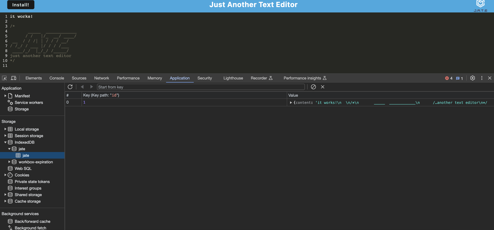
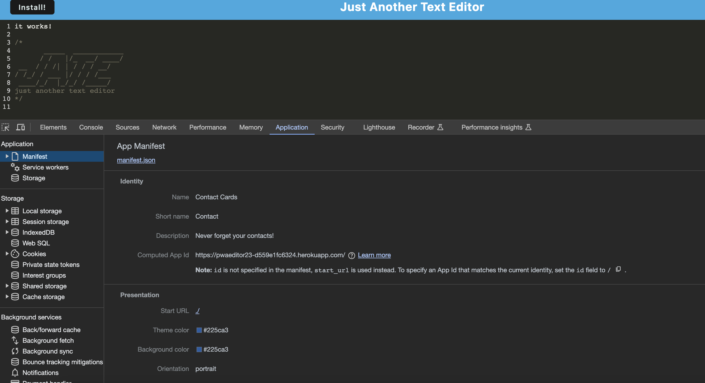

# PWA-Text-Editor

## Description

Using the starte code provided, the application is a web text editor where the user can create notes or code snippets with or without an internet connection and where the user can reliably retrieve them for later use. The integrated service worker and Cache API's ensure that the application will remain fully functional even without and active internet connection. This application allows the user to access visited pages even if the application is offline.

Deployed Heroku Link: https://pwaeditor23-d559e1fc6324.herokuapp.com/
## Table of Contents 

- [Installation](#installation)
- [Usage](#usage)
- [Credits](#credits)
- [License](#license)

## Installation

Ensure to install the following:
  * npm install express (express.js)
  * npm install --save-dev webpack (Webpack)
  * npm install webpack-dev-server --save-dev (webpack-dev-server)
  * npm install --save-dev webpack-pwa-manifest (WebpackPwaManifest)
  * npm install babel (Babel)
  * npm install --save-dev css-loader (CSS-loader)
  * npm install concurrently --save (run multiple commands concurrently.) (Concurrently)
  * npm npm install idb (IndexedDB)

## Usage
The following criteria was given from the bootcamp:
## User Story

AS A developer 
I WANT to create notes or code snippets with or without an internet connection 
SO THAT I can reliably retrieve them for later use 
## Acceptance Criteria

GIVEN a text editor web application 
WHEN I open my application in my editor 
THEN I should see a client server folder structure 
WHEN I run `npm run start` from the root directory 
THEN I find that my application should start up the backend and serve the client 
WHEN I run the text editor application from my terminal 
THEN I find that my JavaScript files have been bundled using webpack 
WHEN I run my webpack plugins 
THEN I find that I have a generated HTML file, service worker, and a manifest file 
WHEN I use next-gen JavaScript in my application 
THEN I find that the text editor still functions in the browser without errors 
WHEN I open the text editor 
THEN I find that IndexedDB has immediately created a database storage 
WHEN I enter content and subsequently click off of the DOM window 
THEN I find that the content in the text editor has been saved with IndexedDB 
WHEN I reopen the text editor after closing it 
THEN I find that the content in the text editor has been retrieved from our IndexedDB 
WHEN I click on the Install button 
THEN I download my web application as an icon on my desktop 
WHEN I load my web application 
THEN I should have a registered service worker using workbox 
WHEN I register a service worker 
THEN I should have my static assets pre cached upon loading along with subsequent pages and static assets 
WHEN I deploy to Heroku 
THEN I should have proper build scripts for a webpack application 

## Screenshots

IndexedDB:

Manifest:

## Credits

I would like to thank Alexis San Javier for conceptualizing and debugging code.

## License

MIT License

Copyright (c) 2023 WarrenAdam

Permission is hereby granted, free of charge, to any person obtaining a copy
of this software and associated documentation files (the "Software"), to deal
in the Software without restriction, including without limitation the rights
to use, copy, modify, merge, publish, distribute, sublicense, and/or sell
copies of the Software, and to permit persons to whom the Software is
furnished to do so, subject to the following conditions:

The above copyright notice and this permission notice shall be included in all
copies or substantial portions of the Software.

THE SOFTWARE IS PROVIDED "AS IS", WITHOUT WARRANTY OF ANY KIND, EXPRESS OR
IMPLIED, INCLUDING BUT NOT LIMITED TO THE WARRANTIES OF MERCHANTABILITY,
FITNESS FOR A PARTICULAR PURPOSE AND NONINFRINGEMENT. IN NO EVENT SHALL THE
AUTHORS OR COPYRIGHT HOLDERS BE LIABLE FOR ANY CLAIM, DAMAGES OR OTHER
LIABILITY, WHETHER IN AN ACTION OF CONTRACT, TORT OR OTHERWISE, ARISING FROM,
OUT OF OR IN CONNECTION WITH THE SOFTWARE OR THE USE OR OTHER DEALINGS IN THE
SOFTWARE.
